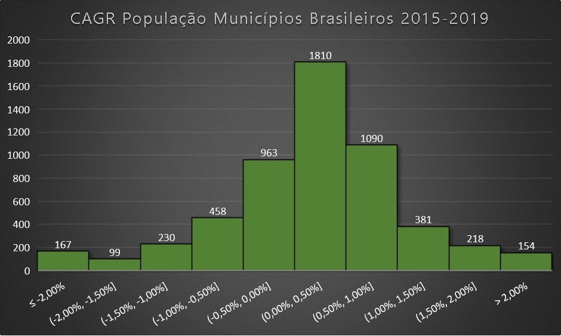

# IBGE

O IBGE calcula e divulga "estimativas do total da população dos Municípios e das Unidades da Federação brasileiras, com data de referência em 1o de julho, para o ano calendário corrente."  
Dados desde 1975 podem ser encontrados na seção de *downloads* da [página](https://www.ibge.gov.br/estatisticas/sociais/populacao/9103-estimativas-de-populacao.html?=&t=o-que-e) de estimativas populacionais no site.

## *Features*

### CAGR da população dos municípios

Consolidando as populações estimadas para os anos entre 2015 e 2019, pode-se obter um [CAGR](https://en.wikipedia.org/wiki/Compound_annual_growth_rate) do período e tentar categorizar os municípios de acordo com seu comportamento.  
A tabela com os números agregados está [aqui](Brazil_Population_CAGR_2015-2019.csv).  

No histograma fica claro que a maior parte das cidades se concentra na região de baixo crescimento.
